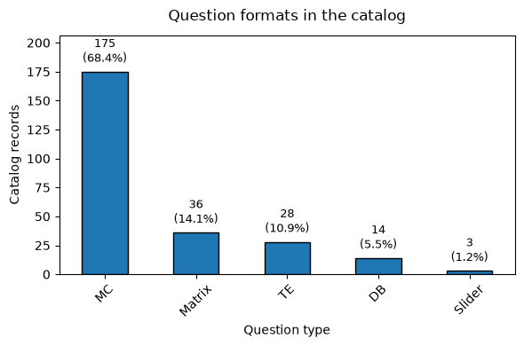
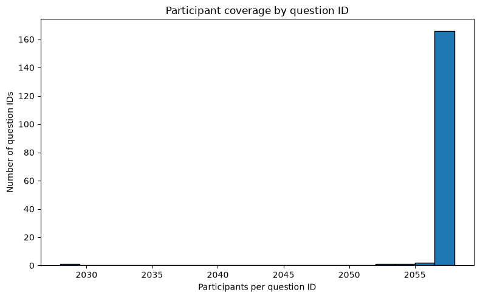

# Large Behavior Model
Train and evaluate large language models (LLMs) that predict survey response based on the participant's persona (response from previous questions) in the [`Twin-2K-500`](https://huggingface.co/datasets/LLM-Digital-Twin/Twin-2K-500) dataset.

## Overview
### Research Objectives & Questions
This work investigates the feasibility of using LLMs to simulate individual human survey respondents. The project evaluates two core research questions:

1. **Persona-Driven Prediction (RQ1):** Can an LLM more accurately predict a participant's held out survey reponses when prompted with a persona constructed from their historical responses?

2. **Finetuning Persona (RQ2):** Can supervised fine-tuning teach the model to follow the required response format and improve persona-conditioned prediction accuracy?

### Analysis Notebooks

The following notebooks provide the reproducible analyses and supporting evidence for this report:

| Notebook | Description |
|---|---|
| [01. Dataset Overview](notebooks/01_dataset_overview.ipynb) | Examines the `full_persona` and `wave_split` configurations, verifies their participant and question relationships, and demonstrates why `wave_split` is required to prevent Wave-4 target leakage. |
| [02. Dataset Composition](notebooks/02_dataset_composition.ipynb) | Describes persona content, participant demographics, question and response formats, question coverage, representativeness, and dataset limitations. |
| [03. Test–Retest Analysis](notebooks/03_test_retest_analysis.ipynb) | Reproduces human test–retest accuracy, reports task-level reliability, and calculates the matched test–retest benchmark used for model evaluation. |
| [04. Model Input Analysis](notebooks/04_model_input_analysis.ipynb) | Measures persona compression and sequence lengths. |
| [05. Evaluation Results](notebooks/05_evaluation_results.ipynb) | Loads evaluation artifacts and compares prediction accuracy, structured-output validity, and response coverage across model conditions. |


## Dataset

### Overview
This project uses the [`Twin-2K-500`](https://huggingface.co/datasets/LLM-Digital-Twin/Twin-2K-500) dataset which contains survey responses from 2,058 US adults across 4 waves. 

### Dataset Configurations and Target Leakage
Twin-2K-500 provides two Hugging Face dataset configurations:
| Configuration | Contents | Modeling use |
|---|---|---|
| `full_persona` | Participant responses aggregated across Waves 1–4 | Exploration only; it must not be used as model context because it contains Wave-4 target responses |
| `wave_split` | Separate waves 1–3 persona, earlier held-out responses, and wave 4 responses | Used for training and evaluation |

Using `full_persona` as model context would expose responses collected in wave 4, including the answers the model is intended to predict. This would create target leakage and inflate evaluation performance.

Therefore, all modeling experiments use the `wave_split` configuration. The model receives the non-held-out waves 1–3 persona as context. The corresponding Wave-4 response is used as the prediction target. Earlier held-out responses are retained only for human test–retest
analysis and the prior-answer baseline.

The `wave_split` configuration organizes each participant's data into three components:

| Component | Field | Use |
|---|---|---|
| Persona | `wave1_3_persona_text` | Model context |
| Earlier held-out answers | `wave4_Q_wave1_3_A` | Test–retest |
| Wave-4 answers | `wave4_Q_wave4_A` | Model training and evaluation target |

### Question and Response Formats
As illustrated in Figure 1, the dataset comprises of five question formats: *Multiple Choice (MC)*, *Matrix*, T*ext Entry (TE)*, *Descriptive Block (DB)*, and *Slider*. Table 1 provides a summary of each question and response format. 



*Figure 1: Breakdown of question formats present in the dataset.*


| Format | Meaning | Response representation |
|---|---|---|
| `MC` | Multiple Choice: one or more options selected from a provided list | `SelectedByPosition` stores option positions; `SelectedText` stores option labels |
| `Matrix` | Contains multiple statements where participants answer each one using the same set of options. | Lists in `SelectedByPosition` and `SelectedText`, with one entry per statement |
| `Slider` | One or more numeric rating scales | Numeric responses stored in `Values` |
| `TE` | Text Entry: a typed text or numeric response | Responses stored in `Text` |
| `DB` | Descriptive Block: instructions, scenarios, or contextual information | No participant response |

### Persona Composition
Each participant's persona is constructed from their responses collected in waves 1-3. The questions selected for wave 4 retesting are excluded from the persona. This prevents the model from target leakage. 

The persona contains four key categories:
1. **Cognitive tests**: Questions that test participants’ reasoning, logic, and how well they think they performed.
2. **Personality**: Questions about participants’ personality, feelings, behaviours, and how they see themselves.
3. **Economic preferences**: Questions about how participants make decisions involving money, trust, sharing, and financial gains.
4. **Demographics**: Questions about participants’ background, such as age, education, income, religion, politics, and employment.


In addition to understanding what information the personas contain, it is also important to determine whether questions asked are consistent across participants. Large difference in questions covered could mean that some personas contain more contexual information than others.

Figure 2 presents a breakdown of how many participant encountered each (`BlockName`,`QuestionID`) combination in their waves 1-3 persona. Majority of question IDs appear in all or nearly all participants personas. This indicates that the persona follows a generally consistent survey structure and that differences between personas primarily arise from participants' responses. 



It is worth mentioning that `QuestionID` does not always provide a 1-1 mapping to `QuestionText`. For example, both of the following questions use share the same `QuestionID`:

**QID9_12**
```text
Please consider the following product category: Yogurt - Refrigerated. Suppose you are in a grocery store, and you see the following product in that category: Chobani Non-Fat Greek Yogurt, Vanilla Blended 32 oz, Plastic. The product is priced at: $7.81. Would you or would you not purchase this product?
```

**QID9_12**
```text
Please consider the following product category: Yogurt - Refrigerated. Suppose you are in a grocery store, and you see the following product in that category: Chobani Non-Fat Greek Yogurt, Vanilla Blended 32 oz, Plastic. The product is priced at: $8.93. Would you or would you not purchase this product?

```


*Figure 2: Breakdown of how many participant encountered each question ID in their waves 1-3 persona.*


Deeper analysis of the question and response formats as well as the persona compositoon is available in the [dataset compisition notebook](notebooks/02_dataset_composition.ipynb). 


### Dataset Limitations
The dataset has several limitations that affect how the modeling results should be interpreted:

1. **Population scope**: The datatset is restricted to US adults recruited through Prolific (Toubia et al., 2025). Therefore the findings should not be generalized directly to other countries or cultural contexts. 

2. **Participant attrition**: The final dataset only includes the 2,058 participants who completed all four waves, compared to the 2,509 respondents in wave 1. Participants who remained through all four waves may differ systematically from those who dropped out, potentially introducing attrition or selection bias.


## Model Development Plan
The objective is to determine whether a LLM can predict an individual's held-out survey responses using their earlier survey history. 

### Train, Test and Validation Split
To evaluate model performance for behavioral modeling, the dataset is split into training ($70\%$), validation ($10\%$), and testing ($20\%$). The split is performed at the participant level using the participant ID (`pid`). This ensures that all observations associated with a participant remain within the same split and prevents information from the same participant from appearing in both the training and evaluation sets. 

This allows the model to be evaluated on its ability to generalize to unseen participants.

The script used to perform the data split is located at `scripts/preprocess_data.py`.

| Split | Participants | Examples | Percentage |
|---|---:|---:|---:|
| Train | 1,440 | 90,720 | 69.97% |
| Validation | 205 | 12,915 | 9.96% |
| Test | 413 | 26,019 | 20.07% |


### Format LLM Input and Target 
Each example is represented with three key components:
1. **Context**: The participant's persona, constructed from the non-held-out survery response (`wave1_3_persona_json`, `wave1_3_persona_text`).
2. **Input**: The held-out survey question, excluding participant response (`wave4_Q_wave4_A`).
3. **Target**: The participant's response to the held-out question (`wave4_Q_wave4_A`).

The persiba and held-out question are provided to the model as inputs while the observed response is used as the prediction target. 

Prompt construction and response formatting are implemented in `src/behavior_modeling/data/prompt_formatting.py`.


### Supervised Fine-tuning

Prompt instructions alone do not gurantee that an open-weight model will consistently produce responses that matches the output schema. During intial evaluation, the base **Qwen2.5-0.5B-Instruct** model produced malformed outputs for some survey questions. For example, for participant `304` and question `QID203`, 

```text
Consider the following situation: A die with 4 red faces and 2 green faces will be rolled 6 times. Before each roll, you will be asked to predict which color—red or green—will show up once the die is rolled.

Which color is most likely to show up after each roll?

Response options:
1 = red
2 = green

1. Roll #1
2. Roll #2
3. Roll #3
4. Roll #4
5. Roll #5
6. Roll #6
```

The model returned:

```json
{
  "SelectedByPosition": [1, 2, 3, 4, 5, 6],
  "SelectedText": ["green"]
}
```

The target response was:
```json

{
  "SelectedByPosition": [1, 1, 1, 1, 1, 1],
  "SelectedText": ["red", "red", "red", "red", "red", "red"]
}
```
For matrix questions, `SelectedByPosition` should contain the selected response-option index for each question and `SelectedText` should contain the corresponding response text. Instead, the model appears to have interpreted `SelectedByPosition` as the six matrix-row positions and generated only a single value for `SelectedText`.

This motivates the use of supervised finetuning (SFT) as it matches the learning problem. SFT was selected as verified target responses are already available. Each trainign example contains the participant persona and held-out question as input, and the observed response serves as the ground-truth target.

During training, loss is computed over the target response tokens. The persona and held-out question provide conditioning context but do not directly contribute to the loss. This trains the model to learn both:
- the required output structure
- the mapping from a participant's persona to their held out response

### Parameter-Efficient Finetuning with LoRA

Finetuning is perfomed using Low-Rank Adaptation (LoRA) rather than full-parameter fine-tuning. LoRA keeps the base-model weights frozen and introduces a smaller set of trainable low-rank parameters.

This reduces the number of training paramters, optimizer-state memory, checkpoint size, and overall GPU-memory requirements. It therefore proves a practi al approach for testing whether supervised fine-tuning improves prediction performance before considering larger models or more computationally expensive training strategies.

The LoRA configuration used in this experiment is
| Parameter | Value |
|---|---|
| Rank (`r`) | 16 |
| Alpha | 32 |
| Dropout | 0.05 |
| Target modules | `q_proj`, `k_proj`, `v_proj`, `o_proj`, `gate_proj`, `up_proj`, `down_proj` |
| Trainable parameters | 8,798,208 |
| Trainable parameter percentage | 1.7497% |


### Base Model and Context Length
The initial experiments use **Qwen2.5-0.5B-Instruct** as the base model. The model was selected to reduce iteration time and computational cost while validating the end-to-end preprocessing, training, generation, parsing, and evaluation pipelines.

[Qwen2.5-0.5B-Instruct](https://huggingface.co/Qwen/Qwen2.5-0.5B-Instruct) supports a maximum context length of 32,768 tokens and can generate up to 8,192 tokens. However, fitting within the context window does not guarantee that the model can effectively use all information in a long persona. Longer inputs may make it more difficult for the model to identify and learn from the most relevant participant information. Therefore, reducing redundant survey text can improve both context efficiency and the signal available to the model.

### Persona Representation
The original persona follows a question-and-answer structure derived from the survey records. While this preserves information from the original survey, it also repeats structural text such as question types, response-option lists, labels, and other survey scaffolding.

To reduce context length, a **compact persona representation** is constructed. It retains each survey question and the participant's resolved answer while removing repeated metadata, response options, and formatting instructions that are not required to interpret the response. 

Token counts were calculated using the `Qwen/Qwen2.5-0.5B-Instruct` tokenizer without truncation.

| Split | Participants | Raw mean | Raw median | Raw maximum | Compact mean | Compact median | Compact maximum | Mean reduction |
|---|---:|---:|---:|---:|---:|---:|---:|---:|
| Train | 1,440 | 27,526.6 | 27,512.5 | 28,760 | 16,587.0 | 16,571.5 | 17,816 | 39.7% |
| Validation | 205 | 27,520.3 | 27,515.0 | 27,962 | 16,582.2 | 16,580.0 | 17,096 | 39.7% |
| Test | 413 | 27,526.1 | 27,518.0 | 27,932 | 16,590.9 | 16,572.0 | 16,999 | 39.7% |

*Token columns report the number of tokens per participant persona.*

The compact representation reduces persona length by approximately 39.7% across all three splits, from an average of approximately 27,526 tokens to 16,587 tokens. The similar distributions across splits indicate that the participant-level split did not introduce a substantial difference in persona length.
 

### Model Training
The model is finetuned for one epoch using a subset of 5,000 examples from the training split. To limit computational cost while validating the end-to-end training and evaluation pipeline, evaluation is also conducted on deterministic samples of 5,000 examples form the validation and test splits. 

The participant-level train, validation and test split is performed before question-level sampling. This ensures that participants remain disjoint across splits. Examples are then sampled using a fixed random seed. This allows the same subsets to be used across experiments and repeated runs.

Although the compact personas contain approximately 16,587 tokens on average, the experimental sequence limit is 8,192 tokens. Persona context is therefore limited to 7,000 tokens, leaving capacity for the system instructions, held-out question, chat-template tokens, and target response. This truncation is a computational constraint for the initial experiment and does not imply that information beyond 7,000 tokens is irrelevant.

The training configuration is summarized as follows:

| Setting | Value |
|---|---|
| Base model | `Qwen/Qwen2.5-0.5B-Instruct` |
| Epochs | 1 |
| Learning rate | \(2 \times 10^{-4}\) |
| Per-device batch size | 1 |
| Gradient accumulation steps | 8 |
| Effective batch size | 8 on one GPU |
| Maximum sequence length | 8,192 tokens |
| Optimizer | AdamW (Hugging Face `Trainer` default) |
| Precision | BF16 |
| LoRA rank | 16 |
| Random seed | 42 |


This initial experiment is intended to verify the training pipeline and assess the effect of supervised finetuning under a limited-data setting.

### Compute Environment

Training and evaluation were performed using the following compute environment:

| Resource | Configuration |
|---|---|
| GPU | 1 × NVIDIA H100 SXM |
| GPU memory | 80 GB |
| CPU | 28 vCPUs, Intel Xeon Platinum 8480+ |
| System memory | 251 GB |
| Container storage | 50 GB |

## Evaluation
The evaluation accesses whether an LLM can predict participant help-out survey responses from their historical survey data and whether supervised finetuning improves this capability. The experiments addresses the two research questions:

-  **Persona-Driven Prediction (RQ1):** Can an LLM more accurately predict a participant's held out survey reponses when prompted with a persona constructed from their historical responses?

- **Finetuning Persona (RQ2):** Can supervised finetuning teach the model to follow the required response format and improve persona-conditioned prediction accuracy?

### Experimental Conditions

Four model conditions are evaluated to study the effects of persona conditioning and supervised finetuning:

| Condition                        | Persona | Fine-tuned | Purpose                                                              |
| -------------------------------- | ------: | ---------: | -------------------------------------------------------------------- |
| Base model + question only       |      No |         No | Baseline condition                                                   |
| Finetuned model + question only |      No |        Yes | Measures the effect of finetuning without persona information       |
| Base model + persona             |     Yes |         No | Measures the effect of persona context on the base model        |
| Finetuned model + persona       |     Yes |        Yes | Measures the combined effect of persona context and fine-tuning |


The ablation study allows the effects of persona conditioning and supervised fine-tuning to be evaluated seperately. 

For **RQ1**, persona-based prediction is evaluated by comparing:
- Base model + question only vs base model + persona
- Finetuned model + question only vs finetuned model + persona

For **RQ2**, the effect of supervised finetuning is evaluated by comparing
- Base model + question only vs. fine-tuned model + question only
- Base model + persona vs. fine-tuned model + persona

These comparisons also indicate whether the benefit of persona information changes after supervised fine-tuning.

### Evaluation Strategy
Following Toubia et al. (2025), the participant's response for each held-out question for waves 1-3 is treated as the ground-truth. Model predictions are evaluated against the waves 4 responses.


| Evaluation | Ground-truth reference | Prediction or comparison |
|---|---|---|
| Model evaluation | wave 4 response | Model prediction |
| Human test–retest | Earlier waves 1–3 held-out response | wave 4 response |


Toubia et al. (2025) evaluate 88 repeated hold-out questions grouped into 17 behavioral tasks. Binary responses receive a score of 1 when the responses match and 0 otherwise. For non-binary responses, accuracy is based on the absolute difference between the predicted and observed response relative to the valid response range. Scores for questions belonging to the same behavioral task are averaged so that each task contributes a single task-level accuracy measure. 

The original study reports an average human test–retest accuracy of 81.72% across the 17 tasks. We reproduced this analysis in [test retest analysis notebook](notebooks/03_test_retest_analysis.ipynb) and obtained an overall test–retest accuracy of 81.73%, closely matching the reported result.

Human test-retest accuracy measures the stability of participant responses over time and should not be interpreted as a strict upper bound on model performance.


### Evaluation Metrics
Model performance is evaluated across three key categories: format accuracy, prediction accuracy and coverage.

#### Format Accuracy
Structured output is required so that the model response can be parsed and evaluated. JSON is used as the output representation, and the following metrics measure if the response adheres to the expected format.


| Metric | Definition |
|---|---|
| `valid_json_rate` | Fraction of raw model outputs that can be parsed directly as JSON without modification. |
| `format_repair_rate` | Fraction of all model outputs that become parseable after minimal repair, such as removing a surrounding Markdown code fence. |
| `valid_schema_rate` | Fraction of outputs that, after parsing or repair, contain the required keys, value types, and response structure for the corresponding question type. |

#### Prediction Accuracy
Two complementary metrics are used to evaluate prediction accuracy.

| Metric | Definition |
|---|---|
| **Exact-match accuracy** | Fraction of question-level predictions that exactly match the complete target response. For matrix questions, all rows must match for the example to receive credit. |
| **Task-weighted normalized accuracy** | Normalized response scores are averaged within each participant-task pair, then equally across tasks for each participant, and finally across participants. Only scoreable predictions are included. |
| **Task-weighted normalized accuracy including invalid predictions** | The same task-weighted calculation, but invalid or unscoreable model predictions receive a score of zero. This is the primary model-evaluation metric because it captures both behavioral accuracy and evaluation coverage. |

For binary questions, the score is based on exact match:

$$
s = \mathbb{1}[y = \hat{y}]
$$

For non-binary questions, the score is:

$$
s = 1 - \frac{|y - \hat{y}|}{U - L}
$$

where:

- $y$ is the ground-truth response,
- $\hat{y}$ is the predicted response,
- $L$ is the minimum valid response value, and
- $U$ is the maximum valid response value.

A score of 1 indicates an exact match, while lower scores indicate greater disagreement between the predicted and ground-truth responses.

Question-level scores are first averaged within each behavioral task. The task-level scores are then averaged so that each of the 17 behavioral tasks contributes equally to the overall accuracy.


#### Coverage

Formatting errors can prevent generated responses from being scored. Coverage metrics measure how much of the evaluation set produces usable predictions.

 Metric | Definition |
|---|---|
| `eligible_responses` | Number of atomic human responses available for evaluation. A matrix example may contribute multiple eligible responses. |
| `scored_responses` | Number of eligible responses for which the model produced a complete, valid prediction. |
| `scoreable_response_rate` | Proportion of eligible responses that could be scored, calculated as `scored_responses / eligible_responses`. |
| `scored_tasks` | Number of behavioral tasks containing at least one scoreable model prediction. |


## Evaluation Results
All four conditions were evaluated on the same determinsitic sample of 5,000 examples from the test split.

The primary evaluation metric is **task-weighted normalized accuracy including invalid predictions**. Invalid or unscoreable predictions receive zero score. This prevents models with poor output formatting from obtaining inflated accuracy by excluding their failed predictions.

The models used for evaluation are as follows:
| Model condition | Description |
|---|---|
| Base model, no persona | Base `Qwen2.5-0.5B-Instruct` predicts responses using only the survey question. This measures generic survey-answering behavior without persona or task-specific training. |
| Base model + persona | Base `Qwen2.5-0.5B-Instruct` receives the participant’s persona and the survey question as part of the input prompt. This tests whether the model can use participant history through prompting alone. |
| Fine-tuned model, no persona | `Qwen2.5-0.5B-Instruct` fine-tuned on survey question–response examples without persona context. This measures learning of the survey task, response distributions, and output schema. |
| Fine-tuned model + persona | `Qwen2.5-0.5B-Instruct` fine-tuned on personas and survey question–response examples. This is the complete persona-conditioned behavioral model. |
| Human test–retest | Agreement between participants’ earlier held-out responses and their wave 4 responses. It measures human response stability and provides a reference benchmark, not a strict model-performance upper bound. |

### Overall Prediction Performance

| Model condition | Exact-match accuracy | Task-weighted normalized accuracy | Primary accuracy including invalid |
|---|---:|---:|---:|
| Base model, no persona | 19.54% | 28.05% | 21.50% |
| Base model + persona | 41.26% | 51.13% | 40.41% |
| Fine-tuned model, no persona | 45.02% | **67.45%** | **67.45%** |
| Fine-tuned model + persona | **45.82%** | 67.42% | 67.42% |
| Human test–retest (reference only) | — | 83.45% | Not applicable |

The primary metric is task-weighted normalized accuracy including invalid predictions. Invalid or unscoreable responses receive zero credit under this metric.

### Formatting Accuracy

| Model condition | Valid JSON | Format repaired | Valid schema |
|---|---:|---:|---:|
| Base model, no persona | 5.98% | 93.28% | 96.32% |
| Base model + persona | 0.04% | 98.96% | 97.10% |
| Fine-tuned model, no persona | 100.00% | 0.00% | 100.00% |
| Fine-tuned model + persona | 100.00% | 0.00% | 100.00% |

The base model frequently enclosed its responses in Markdown code fences. This explains the low raw valid-JSON rates and high format-repair rates. 

Both fine-tuned models returned valid JSON for every evaluated example. This indicates that supervised fine-tuning successfully taught the model the expected response formats within the evaluated sample.


### Coverage
| Model condition | Question examples | Scored responses | Eligible responses | Scoreable rate | Scored tasks |
|---|---:|---:|---:|---:|---:|
| Base model, no persona | 5,000 | 4,619 | 7,375 | 62.63% | 13 / 17 |
| Base model + persona | 5,000 | 6,093 | 7,375 | 82.62% | 14 / 17 |
| Fine-tuned model, no persona | 5,000 | 7,375 | 7,375 | 100.00% | 17 / 17 |
| Fine-tuned model + persona | 5,000 | 7,375 | 7,375 | 100.00% | 17 / 17 |

The number of eligible responses exceeds the number of question examples as matrix questions contain multiple rows that are scored independently.

The base models failed to produce scoreable predictions for every response. On the other hand, both fine-tuned models produced scoreable predictions for all 7,375 responses across all 17
behavioral tasks. This supports the conclusion that SFT improved response-structure compliance and evaluation coverage.


### RQ1: Effect of persona information

| Model | Without persona | With persona | Persona effect |
|---|---:|---:|---:|
| Base model | 21.50% | 40.41% | **+18.91%** |
| Fine-tuned model | 67.45% | 67.42% | **−0.03%** |

The base model benefited substantialy from persona context. However, the finetuned model achieved near identical task-weighted accuracy with and without the persona. The current results do not show that the fine-tuned model learned to use participant-specific context effectively.

### RQ2: Effect of supervised fine-tuning
| Input condition | Base model | Fine-tuned model | Fine-tuning effect |
|---|---:|---:|---:|
| Without persona | 21.50% | 67.45% | **+45.95 pp** |
| With persona | 40.41% | 67.42% | **+27.01 pp** |

Supervised fine-tuning substantially improved the primary accuracy metric under both conditions. It also increased valid JSON, schema validity, scoreable-response coverage, and task coverage to 100%.


### Summary
SFT demostrated a substantial improvement in prediction accuracy and resolved the observed output-formatting failures. Persona information improved the zero-shot base model, but it did not improve the fine-tuned model. This preliminary experiment provides strong evidence that SFT teaches the survey prediction task and response schema, but it does not yet demonstrate successful persona conditioning.

In addition, it is worth noting that this experiment truncates persona to `max_tokens=7000`.
This may remove persona details relevant to some held-out questions. Further experiments should compare truncated and untruncated personas, alternative persona-compression strategies, and retrieval of question-relevant persona details.


## Business Applications
An accurate behavior model could support research and decision-making by simulating like human response. Potential applications include:

1. **Product and pricing research**: Businesses could use simulated responses to explore reactions to product concepts, pricing scenarios and purchase intentions across customer segments. The results could help prioritize conditions for subsequent validation with human participants. 

2. **Marketing concept testing**: Businesses could conduct preliminary tests on marketing materials across audience segments before investing in larger human studies. This could identify unclear or potentially inappropriate messages and prioritize concepts for further testing.

3. **Testing Research Ideas**: Researchers could use simulated response to compare different versions of experiments before conducting a human study. This could help identify which questions, scenarios, or study conditions are most useful to test with real participants.

These simulations should be treated as decision-support tools rather than replacing human research or user testing. Responses generated by the model should also be validated against actual human response before they are used to make business decisions. 

In addition, behavioral model should not be used for employment, credit, insurance, healthcare, political targeting, or other high-stakes decision targeting individuals. 


## Model Maintenance and Governance
A deployed behavior modeling system would require ongoing monitoring as population, social attitudes, datasets and langauge models can change over time.

### Performance Monitoring
Performance of behavioral tasks across demogrpahic groups should be monitored periodically with an evaluation dataset to capture potential data or concept drift. 

### Data and Concept Drift
Survey responses may change as social, economic, and political conditions evolve. Performance should therefore be periodically validated using newly collected human responses. Retraining should be considered when accuracy declines or when the orginal participant samples no longer represent the population of its intended application. 

### Privacy and Security
Personas contain demographic, political, religious, financial, and behavioral information. Access should follow data-minimization and least-privilege principles. Raw records and model artifacts should be stored securely, and generated outputs should not expose identifiable participant information. 


## Running the Training and Evaluation Code
The section provides the commands used to reproduce model training and evaluation results. Due to computational constraints, the intial proof-of-concept (PoC) trains on a deterministic sample of 5,000 examples. This smaller-scale experiment validates the end-to-end training and evaluation pipeline, providing preliminary evidence about the effects of SFT and persona context.

Four experimental conditions were evaluated:

1. Base model with a compact persona
2. Fine-tuned model with a compact persona
3. Base model without a persona
4. Fine-tuned model without a persona

These experiments provide an intial comparison of the effects of SFT and persona context.


### Install System Tools and `uv`

```bash
apt-get update
apt-get install -y git tmux curl htop

curl -LsSf https://astral.sh/uv/install.sh | sh
source "$HOME/.local/bin/env"
```

### Clone and Install the Project

```bash
cd /workspace
git clone https://github.com/luishengjie/large-behavior-model.git
cd large-behavior-model

uv sync --extra train
```

### Preprocess the Dataset

Download `Twin-2K-500`, create participant-level train, validation, and
test splits, and generate compact personas:

```bash
uv run python scripts/preprocess_data.py \
  --data-config configs/data/twin2k500.yaml
```

If the output directory already exists and should be regenerated:

```bash
uv run python scripts/preprocess_data.py \
  --data-config configs/data/twin2k500.yaml \
  --overwrite
```

### Prepare Prompt Data

Prepare SFT prompts using the compact Wave 1–3 persona:

```bash
uv run python scripts/prepare_prompt_data.py \
  --data-config configs/data/twin2k500.yaml \
  --model-config configs/models/qwen25_05b_lora.yaml \
  --persona-field wave1_3_compact_persona_text \
  --target-field wave4_Q_wave4_A \
  --output-dir data/processed/prompts/qwen25_05b_compact
```

Prepare equivalent prompts without participant persona context:

```bash
uv run python scripts/prepare_prompt_data.py \
  --data-config configs/data/twin2k500.yaml \
  --model-config configs/models/qwen25_05b_lora.yaml \
  --exclude-persona \
  --target-field wave4_Q_wave4_A \
  --output-dir data/processed/prompts/qwen25_05b_no_persona_train
```

### Train the Models

Train the compact-persona LoRA adapter:

```bash
uv run python scripts/train_sft.py \
  --model-config configs/models/qwen25_05b_lora.yaml \
  --prompt-data-dir data/processed/prompts/qwen25_05b_compact \
  --output-dir outputs/qwen25_05b_compact_5000 \
  --n-samples 5000
```

Train the no-persona LoRA adapter:

```bash
uv run python scripts/train_sft.py \
  --model-config configs/models/qwen25_05b_lora.yaml \
  --prompt-data-dir data/processed/prompts/qwen25_05b_no_persona_train \
  --output-dir outputs/qwen25_05b_no_persona_5000 \
  --n-samples 5000
```

### Evaluate Models with a Compact Persona

Evaluate the base model with compact persona context:

```bash
uv run python scripts/evaluate_model.py \
  --model-config configs/models/qwen25_05b_lora.yaml \
  --prompt-data-dir data/processed/prompts/qwen25_05b_compact \
  --output-dir outputs/evaluation/qwen25_05b_base_5000_eval \
  --split test \
  --n-samples 5000 \
  --max-new-tokens 128
```

Evaluate the fine-tuned model with compact persona context:

```bash
uv run python scripts/evaluate_model.py \
  --model-config configs/models/qwen25_05b_lora.yaml \
  --prompt-data-dir data/processed/prompts/qwen25_05b_compact \
  --adapter-dir outputs/qwen25_05b_compact_5000 \
  --output-dir outputs/evaluation/qwen25_05b_compact_5000_eval \
  --split test \
  --n-samples 5000 \
  --max-new-tokens 128
```

### Evaluate Models Without a Persona

Evaluate the base model without persona context:

```bash
uv run python scripts/evaluate_model.py \
  --model-config configs/models/qwen25_05b_lora.yaml \
  --prompt-data-dir data/processed/prompts/qwen25_05b_no_persona_train \
  --output-dir outputs/evaluation/qwen25_05b_no_persona_base_5000 \
  --split test \
  --n-samples 5000 \
  --max-new-tokens 128
```

Evaluate the fine-tuned model without persona context:

```bash
uv run python scripts/evaluate_model.py \
  --model-config configs/models/qwen25_05b_lora.yaml \
  --prompt-data-dir data/processed/prompts/qwen25_05b_no_persona_train \
  --adapter-dir outputs/qwen25_05b_no_persona_5000 \
  --output-dir outputs/evaluation/qwen25_05b_no_persona_5000 \
  --split test \
  --n-samples 5000 \
  --max-new-tokens 128
```


## References

- Olivier Toubia, George Z. Gui, Tianyi Peng, Daniel J. Merlau, Ang Li,
  and Haozhe Chen. (2025).
  [*Twin-2K-500: A Dataset for Building Digital Twins of Over 2,000
  People Based on Their Answers to Over 500 Questions*](https://arxiv.org/abs/2505.17479).
  arXiv:2505.17479.
